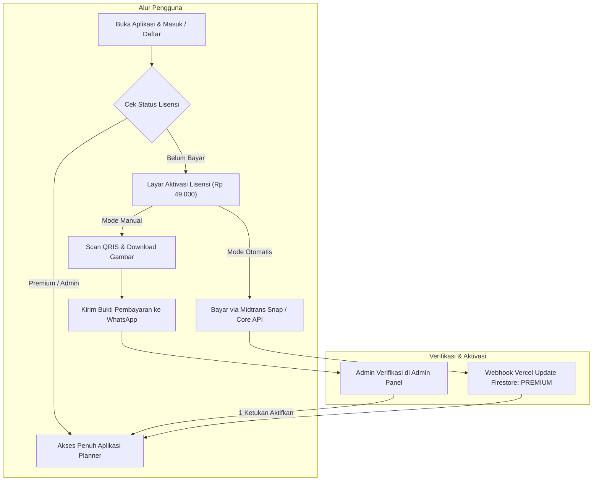

# Panduan Lengkap Setup Firebase, Monetisasi, & Super Admin Nikahin App

Dokumen ini berisi panduan langkah demi langkah untuk mendaftar akun Firebase, melengkapi kredensial aplikasi, mengonfigurasi platform pembayaran (Lynk.id / QRIS / WhatsApp), serta mengoperasikan Panel Super Admin.

---

## 1. Persiapan & Pendaftaran Akun Firebase

### A. Membuat Project Firebase
1. Buka [Firebase Console](https://console.firebase.google.com/) menggunakan akun Google Anda.
2. Klik tombol **"Add project"** (Tambah project).
3. Masukkan nama project, misalnya: `nikahin-wedding-app`.
4. Pilih apakah ingin mengaktifkan Google Analytics (opsional, disarankan aktif).
5. Klik **"Create project"** dan tunggu hingga selesai.

### B. Mengaktifkan Firebase Authentication
1. Pada menu navigasi sebelah kiri, buka **Build > Authentication**.
2. Klik tombol **"Get Started"**.
3. Di tab **Sign-in method**, aktifkan penyedia berikut:
   - **Email/Password**: Klik, lalu centang *Enable*, kemudian klik *Save*.
   - **Google**: Klik, centang *Enable*, pilih Email Dukungan Proyek (*Support Email*), lalu klik *Save*.

### C. Membuat Cloud Firestore Database
1. Di menu navigasi sebelah kiri, buka **Build > Firestore Database**.
2. Klik tombol **"Create database"**.
3. Pilih lokasi database terdekat untuk performa terbaik di Indonesia, misalnya: `asia-southeast2` (Jakarta).
4. Pilih opsi **"Start in production mode"**, lalu klik **Create**.

---

## 2. Pemasangan Security Rules Firestore

Aplikasi Nikahin dilengkapi sistem **Role-Based Access Control (RBAC)** di mana pembeli biasa hanya bisa mengakses dokumen miliknya, sedangkan Super Admin (`rivaldiekaputr@gmail.com`) memiliki otoritas penuh untuk melihat dan mengaktifkan lisensi seluruh pengguna.

1. Buka tab **Rules** pada halaman Firestore Database di Firebase Console.
2. Ganti seluruh isi aturan dengan kode berikut (tersedia juga di file `firestore.rules` proyek Anda):

```javascript
rules_version = '2';
service cloud.firestore {
  match /databases/{database}/documents {
    
    // Fungsi cek apakah request berasal dari Super Admin
    function isAdmin() {
      return request.auth != null && request.auth.token.email == 'rivaldiekaputr@gmail.com';
    }

    // Fungsi cek apakah request berasal dari pemilik data
    function isOwner(userId) {
      return request.auth != null && request.auth.uid == userId;
    }

    // Collection User & Lisensi
    match /users/{userId} {
      allow read: if isOwner(userId) || isAdmin();
      allow create: if isOwner(userId) || isAdmin();
      allow update: if isOwner(userId) || isAdmin();
      allow delete: if isAdmin();
    }

    // Dokumen Pernikahan & Modul Planner
    match /weddings/{weddingId}/{document=**} {
      allow read, write: if request.auth != null;
    }
  }
}
```
3. Klik tombol **"Publish"** di kanan atas.

---

## 3. Melengkapi Kredensial Firebase di Aplikasi

### A. Mendapatkan Web API Key & Project ID
1. Di Firebase Console, klik ikon **Gerigi (Project Settings)** di pojok kiri atas > **General**.
2. Di bagian **"Project ID"**, salin ID project Anda (contoh: `nikahin-wedding-app`).
3. Di bagian **"Web API Key"**, salin kunci API Anda (contoh: `AIzaSy...`).

### B. Mengisi Kredensial di Kode Flutter
Buka berkas `lib/app/config/firebase_config.dart` dan masukkan kredensial Anda:

```dart
class FirebaseConfig {
  /// Project ID Firebase Anda
  static const String projectId = 'MASUKKAN_PROJECT_ID_ANDA_DI_SINI';

  /// Web API Key dari Firebase Console
  static const String apiKey = 'MASUKKAN_WEB_API_KEY_ANDA_DI_SINI';
}
```

*Atau* Anda dapat menyertakannya saat menjalankan build rilis tanpa mengubah kode:
```bash
flutter build apk --release \
  --dart-define=FIREBASE_PROJECT_ID=nikahin-wedding-app \
  --dart-define=FIREBASE_API_KEY=AIzaSyYourApiKeyHere
```

---

## 4. Konfigurasi Monetisasi & Midtrans Payment Gateway

Pengaturan harga, nama paket, endpoint Vercel Snap Token Midtrans, dan nomor WhatsApp admin terpusat di satu berkas:
👉 `lib/app/config/business_config.dart`

```dart
class BusinessConfig {
  /// Email Akun Super Admin yang memiliki hak akses dashboard admin
  static const String adminEmail = 'rivaldiekaputr@gmail.com';

  /// Nomor WhatsApp Admin (Format internasional tanpa simbol +)
  static const String adminWhatsAppNumber = '6285156064977';

  /// Endpoint Vercel Serverless Function Midtrans Snap
  static const String midtransBackendUrl = 'https://track-it-backend-sand.vercel.app/api/create-snap-token';

  /// Harga Paket Lisensi
  static const double lifetimePrice = 49000.0;
  static const double originalPrice = 99000.0;
## 4. Konfigurasi Google Sign-In & Keystore Fingerprint (Debug vs Release)

Google Sign-In pada Android membutuhkan pendaftaran **SHA-1 Fingerprint** dari sertifikat aplikasi di Firebase Console. Dalam pengembangan Android, terdapat 2 jenis keystore:

| Tipe Keystore | Fase Penggunaan | Asal Berkas | Tujuan |
|---|---|---|---|
| **Debug Keystore** | **Development** (Ngoding di laptop, `flutter run`, live reload) | Dibuat otomatis oleh Android SDK di `$HOME/.android/debug.keystore` | Memudahkan pengujian tanpa perlu input password sertifikat setiap kali run |
| **Release Keystore** | **Production** (Rilis APK final, GitHub Actions, Google Play Store) | Dibuat manual oleh developer (`upload-keystore.jks`) | Menjamin integritas dan otentisitas resmi aplikasi rilis |

> [!NOTE]
> Firebase Console dapat menampung **banyak fingerprint SHA-1 sekaligus**. Sangat disarankan mendaftarkan **SHA-1 Debug** (milik laptop developer) dan **SHA-1 Release** agar Google Sign-In dapat berjalan lancar di kedua lingkungan.

### A. Cara Mengambil Fingerprint SHA-1 & SHA-256

#### 1. Debug Keystore (Laptop Anda):
Jalankan perintah berikut di PowerShell:
```powershell
keytool -list -v -keystore "$env:USERPROFILE\.android\debug.keystore" -alias androiddebugkey -storepass android -keypass android
```

Nilai fingerprint debug standar laptop Anda:
- **SHA-1**: `31:20:11:9D:D6:91:E5:BA:B6:A4:0C:B2:C9:A8:15:F0:96:A0:8B:B6`
- **SHA-256**: `97:AD:D0:CE:C3:E7:0D:29:2D:68:99:F8:8A:5E:0A:B1:BE:31:BA:D7:C7:FF:0B:94:AB:A0:C4:BC:B0:59:DC:BF`

#### 2. Release Keystore (Produksi):
Jalankan perintah ini di folder tempat berkas `upload-keystore.jks` berada:
```powershell
keytool -list -v -keystore upload-keystore.jks -alias nikahin_key
```

### B. Mendaftarkan Fingerprint di Firebase Console
1. Buka [Firebase Console](https://console.firebase.google.com/) > Pilih project `nikahin-wedding-app`.
2. Klik ikon **Gerigi (Project Settings)** > Tab **General**.
3. Gulir ke bawah ke bagian **Your apps** > Pilih aplikasi Android (`com.nikahin.app`).
4. Klik tombol **"Add fingerprint"**, masukkan nilai SHA-1 dan SHA-256, lalu klik **Save**.
5. Unduh berkas **`google-services.json`** terbaru dan letakkan di:
   `android/app/google-services.json`

---

## 5. Konfigurasi Mode Pembayaran (Manual vs Otomatis Midtrans)

Aplikasi mendukung 2 mode pembayaran yang dapat diganti kapan saja melalui 1 baris kode di `lib/app/config/business_config.dart`:

```dart
class BusinessConfig {
  // true = QRIS Statis + WhatsApp + Verifikasi Admin Panel
  // false = Direct Midtrans Core API (Otomatis)
  static const bool useManualPaymentMode = true;

  // Nomor WhatsApp konfirmasi pembayaran (+6287834284141)
  static const String manualPaymentWhatsAppNumber = '6287834284141';

  // Email Super Admin
  static const String adminEmail = 'rivaldiekaputr@gmail.com';
}
```



### 🔐 Kredensial & Cara Mengakses Panel Super Admin:
- **Email Super Admin**: `rivaldiekaputr@gmail.com`
- **Kata Sandi (Password)**: Password yang Anda masukkan saat membuat akun pertama kali via form Sign Up aplikasi (atau langsung masuk via *Sign in with Google*).

#### Prosedur Akses & Aktivasi Pengguna:
1. Masuk ke aplikasi menggunakan email: `rivaldiekaputr@gmail.com`.
2. Buka menu **Pengaturan**, lalu klik tombol emas **"Buka Panel Super Admin"** atau ikon perisai di AppBar.
3. Di panel ini Admin dapat:
   - Melihat total pengguna terdaftar, jumlah pending, dan jumlah akun aktif.
   - Melakukan pencarian real-time berdasarkan email atau nama calon pengantin.
   - Memfilter tab (`SEMUA`, `MENUNGGU VERIFIKASI`, `PREMIUM`).
   - Mengaktifkan lisensi pembeli hanya dengan **1 ketukan tombol "Aktifkan"**.
   - Mengubah peran (`SUPER ADMIN`, `PREMIUM`, atau `NONAKTIFKAN`).

---

## 6. Mode Tamu / Demo Interaktif

- Calon pembeli yang belum mendaftar dapat menekan tombol **"Coba Mode Demo (Tamu)"** di layar login.
- Di mode ini, pengguna dapat menjelajahi seluruh dashboard, melihat simulasi anggaran, rundown, checklist berkas KUA, dan daftar tamu.
- Tindakan penambahan, pengubahan, atau penghapusan data akan dilindungi oleh `DemoGuard` dengan pesan interaktif ramah yang mengajak mereka untuk membuat akun dan mengaktifkan lisensi.
