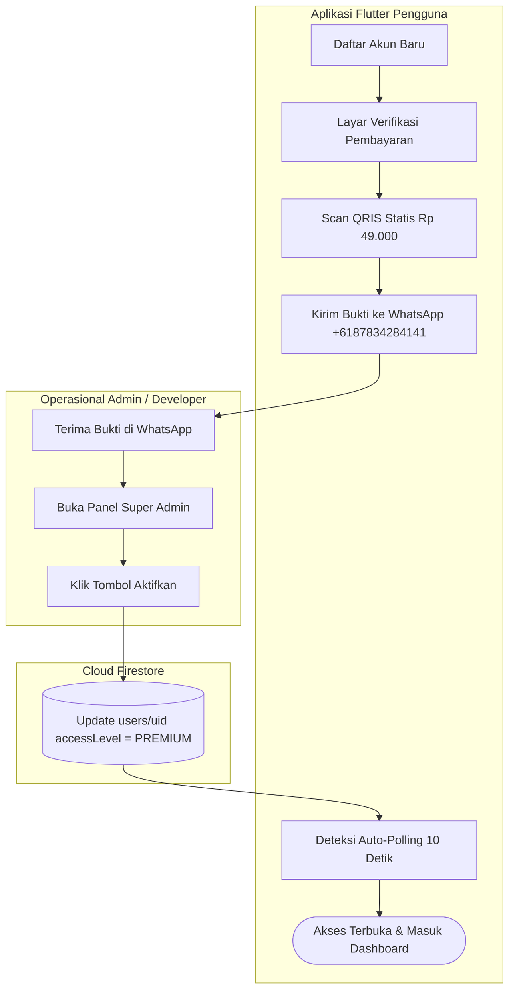
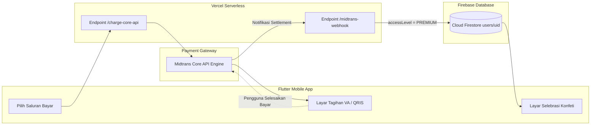

# Panduan Sistem Pembayaran & Monetisasi (Developer Guide)

Dokumen ini merupakan panduan komprehensif bagi developer mengenai arsitektur sistem pembayaran, model monetisasi lisensi, sakelar (*toggle*) mode pembayaran, dan operasional aktivasi pengguna pada aplikasi **Nikahin** (`rivaldiekaptrrr/nikahin_app`).

---

## 📌 1. Ikhtisar Model Monetisasi

Aplikasi Nikahin menggunakan model lisensi **Akses Seumur Hidup (Lifetime Pass)** dengan harga tunggal:
- **Paket**: Paket Wedding Planner Seumur Hidup (Lifetime)
- **Harga Normal**: Rp 99.000
- **Harga Promo / Lifetime**: **Rp 49.000** (Hemat 50%)

Saat pengguna baru mendaftar (hanya dengan Email dan Kata Sandi), hak akses akun berstatus `AccessLevel.none`. Pengguna langsung diarahkan ke layar aktivasi lisensi (`/pending-verification`) untuk memilih salah satu alur pembayaran yang sedang aktif.

---

## 🔘 2. Sakelar Pemilihan Mode Pembayaran (1 Baris Kode)

Pengaturan mode pembayaran terpusat pada 1 baris kode di berkas:
👉 [`lib/app/config/business_config.dart`](file:///c:/Project/nikahin_app/lib/app/config/business_config.dart)

```dart
class BusinessConfig {
  /// Toggle Mode Pembayaran Manual (QRIS Statis & WhatsApp)
  /// Nilai `true` mengaktifkan Mode 1 (Manual QRIS + WhatsApp + Admin Panel)
  /// Nilai `false` mengaktifkan Mode 2 (Otomatis Direct Midtrans Core API)
  static const bool useManualPaymentMode = true;

  /// Nomor WhatsApp Admin untuk Konfirmasi Pembayaran Manual
  static const String manualPaymentWhatsAppNumber = '6187834284141';

  /// Path Asset Gambar QRIS Statis
  static const String manualQrisAssetPath = 'assets/images/qris.jpeg';
}
```

---

## 💳 3. Metode 1: Pembayaran Manual (QRIS Statis + WhatsApp)

Gunakan metode ini saat ingin menerima pembayaran langsung tanpa potongan biaya gateway pihak ketiga atau saat akun Midtrans sedang dalam proses verifikasi.

### A. Alur Kerja Pengguna


### B. Kredensial & Prosedur Aktivasi Admin Panel

#### 🔐 Kredensial Akun Super Admin:
- **Email Super Admin**: `rivaldiekaputr@gmail.com` (Tersinkronisasi dengan aturan keamanan `firestore.rules` dan `BusinessConfig.adminEmail`).
- **Kata Sandi (Password)**: Dibuat saat pendaftaran pertama akun admin di aplikasi atau login via *Google Sign-In* menggunakan email tersebut.
- **Peran**: Otomatis berstatus `SUPER ADMIN` (`AccessLevel.admin`), bebas dari paywall, dan memiliki akses tombol perisai emas menuju Panel Admin.

#### 🛠️ Langkah Demi Langkah Aktivasi Akun Pengguna:
1. Masuk ke aplikasi Nikahin menggunakan akun email admin: `rivaldiekaputr@gmail.com`.
2. Buka tab **Pengaturan** → klik ikon Perisai atau tombol **"Buka Panel Super Admin"** (`/admin`).
3. Pada tab **Menunggu Verifikasi**, cari email pengguna yang sesuai dengan bukti transfer di WhatsApp.
4. Klik tombol hijau **"Aktifkan"**.
5. Nilai `accessLevel` pengguna di Cloud Firestore seketika berubah menjadi `PREMIUM`.
6. Layar pada HP pengguna yang secara otomatis melakukan *polling* setiap 10 detik akan langsung mendeteksi perubahan status dan berpindah ke halaman setup/dashboard pernikahan.

---

## ⚡ 4. Metode 2: Pembayaran Otomatis (Midtrans Core API)

Gunakan metode ini ketika ingin monetisasi berjalan 100% otomatis tanpa campur tangan developer (*zero manual touch*).

### A. Alur Kerja Sistem


Dokumentasi teknis mendalam mengenai Midtrans Core API tersedia di:
👉 [`docs/MIDTRANS_CORE_API_SETUP_GUIDE.md`](file:///c:/Project/nikahin_app/docs/MIDTRANS_CORE_API_SETUP_GUIDE.md)

---

## ⚖️ 5. Perbandingan Kedua Metode

| Parameter | Metode 1: Manual (QRIS + WA) | Metode 2: Otomatis (Midtrans Core API) |
|---|---|---|
| **Biaya Gateway** | Rp 0 (Gratis) | Sesuai MDR Midtrans (QRIS ~0.7%, VA Rp 4.000) |
| **Ketergantungan Server** | Tidak butuh serverless backend | Butuh endpoint Vercel & Webhook URL |
| **Kecepatan Aktivasi Akun** | Tergantung verifikasi manual admin | Seketika (< 3 detik otomatis) |
| **Kemudahan Operasional** | Admin cek bukti transfer di WA | Tanpa campur tangan admin |
| **Peralihan Mode** | Cukup ubah `useManualPaymentMode = true` | Cukup ubah `useManualPaymentMode = false` |

---

## 📁 6. Berkas Penting Terkait

- **Konfigurasi Bisnis & Toggle**: [`lib/app/config/business_config.dart`](file:///c:/Project/nikahin_app/lib/app/config/business_config.dart)
- **Layar Verifikasi Pembayaran**: [`lib/features/auth/presentation/pending_verification_screen.dart`](file:///c:/Project/nikahin_app/lib/features/auth/presentation/pending_verification_screen.dart)
- **Layar Panel Super Admin**: [`lib/features/admin/presentation/admin_dashboard_screen.dart`](file:///c:/Project/nikahin_app/lib/features/admin/presentation/admin_dashboard_screen.dart)
- **Asset QRIS Statis**: [`assets/images/qris.jpeg`](file:///c:/Project/nikahin_app/assets/images/qris.jpeg)
- **Aturan Keamanan Firestore**: [`firestore.rules`](file:///c:/Project/nikahin_app/firestore.rules)
